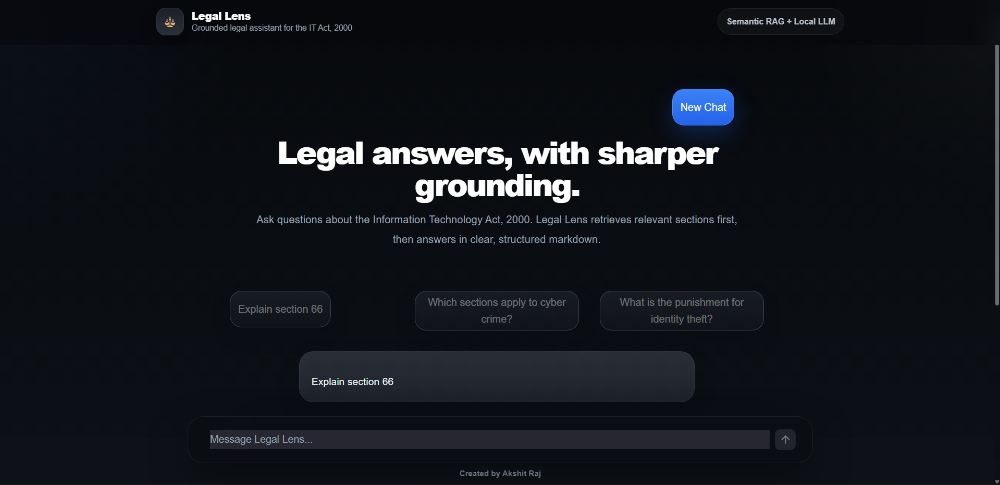

# LegalLens

.png)
.png)

LegalLens is a legal question-answering system built around **The Information Technology Act, 2000**.
Instead of directly sending a user’s question to a language model, this project first retrieves the most relevant legal sections from the Act and then generates an answer using that retrieved context. In simple terms, it works as a **RAG-based legal assistant**, where retrieval happens before generation so that the final answer stays grounded in the source document.

---
### the model could not be deplaoyed due to huge size and gpu requirements and requires paid platform for hosting
*you can download some examples from my conversation with the model to check it out*
## Download Example Files

Here are some example files:

- [sample1.mhtml](Converstaion_With_legal_lens.mhtml)
- [sample4.mhtml](Legal_Lens_explainIneasy.mhtml)
- [sample3.mhtml](Legal_LensAdvanceQues.mhtml)
- [sample2.mhtml](Legal_Lens.mhtml)
## What the project does

- Takes the **IT Act, 2000 PDF** as the source document
- Extracts and cleans the raw text from the PDF
- Splits the document into structured legal sections
- Stores those sections with useful metadata in JSON
- Generates likely user questions for each section to improve retrieval
- Converts both legal sections and user queries into embeddings
- Finds the most relevant sections using semantic similarity
- Passes the retrieved context into **Gemma-3** to generate the final answer
- Serves the system through a **Streamlit** interface

## How it works

### 1. PDF extraction and cleanup
The first part of the project was turning the raw PDF into usable text. I used PDF parsing tools to extract the content and then cleaned it heavily because legal PDFs often contain page numbers, formatting noise, broken spacing, amendment notes, and other text that hurts retrieval quality.

This preprocessing step was important because bad formatting at the document level leads to bad retrieval later.

### 2. Section-level chunking
After cleaning the text, I split the Act into meaningful chunks, mainly at the **section level**. Each chunk was stored with metadata such as:
- chapter name
- section name/number
- section content

This allowed the system to work with structured legal units instead of treating the whole Act as one large block of text.

### 3. Synthetic question generation
One part of the project I focused on was generating **questions for each section** and storing them in JSON along with the section text.

The reason for this was simple: users do not usually ask questions in the same formal language used in legal documents. So instead of relying only on the original section text, I used the model to generate likely user-style questions that each section could answer. This acts like **synthetic query generation** and helps bridge the gap between how the law is written and how people naturally ask questions.

### 4. Embedding-based retrieval
Once the sections were prepared, I created embeddings for the legal content and used semantic similarity to retrieve the most relevant sections for a user query.

When a user asks a question, the system:
1. embeds the question
2. compares it against stored section representations
3. ranks sections by similarity
4. selects the top relevant sections as context

This makes the system more flexible than exact keyword matching, especially when the question and the law use different wording.

### 5. Grounded answer generation with Gemma
After retrieval, the top sections are inserted into a prompt and passed to **Gemma** for answer generation. The prompt is designed so the model answers using only the retrieved legal context instead of inventing unsupported information.

This makes the system more grounded and more useful than a generic chatbot response, especially for document-based question answering.

### 6. Interface
The final system is exposed through a **Streamlit app**, where the user can enter a question and receive an answer generated from the relevant sections of the IT Act.

## Key features

- Legal question answering focused on **The Information Technology Act, 2000**
- RAG pipeline instead of direct free-form generation
- Section-level legal retrieval
- Synthetic query generation for better matching
- Embedding-based semantic search
- Grounded response generation using retrieved context
- Streamlit-based interface for easy interaction

## Tech stack

- **Python**
- **PyMuPDF / pymupdf4llm** for PDF text extraction
- **Regex / text preprocessing** for cleanup
- **JSON / NumPy** for storing structured data and embeddings
- **Sentence embeddings** for retrieval
- **Gemma-3-1b** for answer generation
- **Streamlit** for the frontend

## Challenges worked on in this project

A major part of the work was not just building the pipeline, but improving retrieval quality. Legal documents are difficult because some sections are too generic, some definitions can dominate retrieval, and the best answer is not always obvious from raw similarity alone.

To handle this, I experimented with:
- section-level chunking instead of larger document chunks
- prompt constraints so the model stays grounded
- synthetic question generation for each section
- improving relevance of retrieved context before generation

## Current scope

Right now, LegalLens is designed specifically around the **IT Act, 2000**. The system is built to answer questions from that document and is meant as a focused legal RAG project rather than a general-purpose legal assistant.

## Future improvements

Some improvements I plan to continue working on are:
- better retrieval filtering for noisy sections
- stronger ranking of relevant legal context
- API-based backend integration
- a more polished frontend
- support for broader legal document collections

## Conclusion

LegalLens is a document-grounded legal assistant built as a full pipeline, from raw PDF processing to semantic retrieval and final answer generation. The main focus of the project was not just getting a model to respond, but building a system that retrieves the right legal context first and then generates a more reliable answer from it.


## Setup Instructions

**1. Clone this repository:**
```bash
gh repo clone rezzraj/LegalLens
```
**2.Download the model weights from Google Drive:**
Download model weights: [Click here](https://drive.google.com/file/d/1WBj6kP0iH8ti0FJ4vVhnKsH0cKrqyJob/view?usp=sharing)
```bash
Two Folders:
model/
model_emb/
```
*Place the downloaded file inside the project folder without changing its name.*

**3.Clone the Gemma PyTorch repository:**
```bash
gh repo clone google/gemma_pytorch
```
**4.Install dependencies:**
```bash
pip install -r requirements.txt
```

**5.Run the application:**
streamlit run app.py


*Keep all files inside the project folder and do not rename any files, otherwise the app may not work correctly.*
